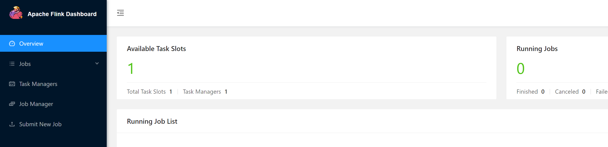
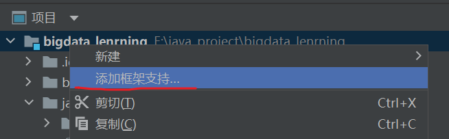
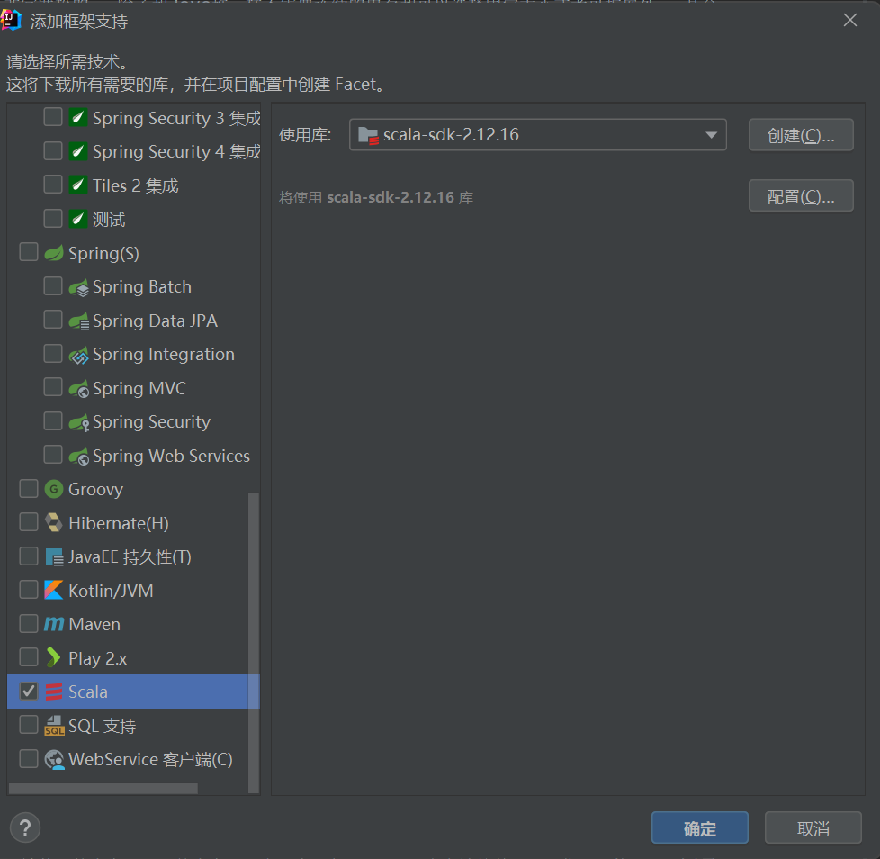

# Flink入门实践

## Flink是什么

Flink是一个分布式计算框架。	

Flink可以搭建廉价机群，快速处理任意规模的数据。


#### flink基本组件

Flink中提供了3个组件，包括DataSource、Transformation和DataSink。

DataSource：数据源组件，主要用来接收数据，目前有readTextFile，socketTextStream，fromCollection以及一些第三方的Source

Transformation：表示算子，主要用来对数据进行处理，如Map，FlatMap，Filter，Reduce，Aggregation等

DataSink：输出组件，主要用来把计算结果输出到其他存储介质中，比如writeAstext以及Kafka，Redis，Elasticsearch等第三方Sink组件

**Flink Job=DataSource+Transformation+DataSink**

## 安装

前提准备：安装包flink-1.10.1.tar.gz

### Local模式

flink在处于local模式下，不需要更改任何配置，直接解压之后启动即可

```shell
$ tar -zxf  flink-1.10.1.tar.gz  -C /opt/modoule/
$ cd /opt/modoule/flink-1.10.1
$ bin/start-cluster.sh
```

启动成功之后，执行jps就能查看到启动了两个进程

```shell
5984 StandaloneSessionClusterEntrypoint
6579 TaskManagerRunner
7002 Jps
```

webUI界面访问：启动两个进程成功之后，访问8081端口号即可访问到flink的web管理界面

http://hadoop102:8081/#/overview



hadoop102新开一个窗口使用linux的nc命令来向socket当中发送一些单词

```shell
$ sudo yum -y install nc
$ nc -lk 7777
```

hadoop102启动flink的自带的单词统计程序，接受输入的socket数据并进行统计

```shell
$ cd /opt/module/flink-1.10.1
$ bin/flink run examples/streaming/SocketWindowWordCount.jar   --hostname localhost  --port 7777
```

flink自带的测试用例统计结果在log文件夹下面

hadoop102执行以下命令查看统计结果

```shell
$ cd /opt/module/flink-1.10.1/log
$ tail -200f flink-hadoop-taskexecutor-0-hadoop102ll.out
```

local模式运行成功之后，关闭local模式

```shell
$ cd /opt/module/flink-1.10.1
$ bin/stop-cluster.sh
```

### standAlone模式

使用standalone模式，需要启动flink的主节点JobManager以及从节点taskManager

| 服务以及ip  | 192.168.10.102 | 192.168.10.103 | 192.168.10.104 |
| ----------- | -------------- | -------------- | -------------- |
| JobManage   | 是             | 否             | 否             |
| TaskManager | 是             | 是             | 是             |


第一步：更改配置文件

```shell
$ cd /opt/module/flink-1.10.1/conf/
$ vim flink-conf.yaml
```

更改这个配置，指定jobmanager所在的服务器为hadoop102

```shell
jobmanager.rpc.address: hadoop102
```

hadoop102服务器更改slaves配置文件
hadoop102执行以下命令更改从节点slaves配置文件

```shell
$ cd /opt/bigdata/install/flink-1.10.1/conf
$ vim slaves
```

```shell
hadoop102
hadoop103
hadoop104
```

第二步：安装包分发

将hadoop102服务器的flink安装包分发到其他机器上面去
hadoop102服务器执行以下命令分发安装包

```shell
$ cd /opt/module
$ scp -r flink-1.10.1/ hadoop103:$PWD
$ scp -r flink-1.10.1/ hadoop104:$PWD
```

第三步：启动flink集群

```shell
$ cd /opt/module/flink-1.10.1
$ bin/start-cluster.sh
```

第四步：页面访问

http://hadoop102:8081/#/overview

第五步：运行flink自带的测试用例

和前面单机模式一样

#### standAloneHA模式

借助于zookeeper实现高可用


第一步：修改配置文件

hadoop102执行以下命令修改Flink的配置文件
hadoop102修改flink-conf.yaml配置文件

```properties
jobmanager.rpc.address: hadoop102
high-availability: zookeeper
high-availability.storageDir: hdfs://hadoop102:8020/flink
high-availability.zookeeper.path.root: /flink
high-availability.zookeeper.quorum: hadoop102:2181,hadoop103:2181,hadoop104:218
```

hadoop102修改masters配置文件

```shell
hadoop102:8081
hadoop103:8081
```

hadoop102修改slaves配置文件

```xml
hadoop102
hadoop103
hadoop104
```

第二步：hdfs上面创建flink对应的文件夹

hadoop102执行以下命令，在hdfs上面创建文件夹

```shell
$ hdfs dfs -mkdir -p /flink
```

第三步：拷贝配置文件

将hadoop102服务器修改后的配置文件拷贝到其他服务器上面去

```shell
$ cd /opt/module/flink-1.8.1/conf
$ scp flink-conf.yaml  masters  slaves  hadoop103:$PWD
$ scp flink-conf.yaml  masters  slaves  hadoop104:$PWD
```

第四步：启动flink集群

hadoop102执行以下命令启动flink集群

```shell
$ cd /opt/module/flink-1.10.1
$ bin/start-cluster.sh
```

第五步：页面访问

访问hadoop102服务器的web界面
http://hadoop102:8081/#/overview
访问hadoop103服务器的web界面
http://hadoop103:8081/#/overview

第六步：模拟故障宕机实现自动切换

将hadoop102服务器的jobManager进程杀死，然后过一段时间之后查看hadoop103的jobManager是否能够访问

 JobManager发生切换时，TaskManager也会跟着发生重启

第七步：HA下提交任务

同上

### flink on yarn模式

hdfs以及yarn服务正常启动


#### 第一种模式：单个yarn session模式

首先启动hadoop集群，接着向yarn申请一块资源空间，启动单个yarn session模式

第一步：修改yarn-site.xml配置为文件

hadoop102执行以下命令修改yarn-site.xml，添加以下配置属性

```shell
$ cd /opt/module/hadoop-3.1.3/etc/hadoop
$ vim yarn-site.xml
```

```xml
<property>
	<name>yarn.resourcemanager.am.max-attempts</name>
	<value>4</value>
	<description>
	The maximum number of application master execution attempts.
	</description>
</property>
```

然后将修改后的配置文件拷贝到hadoop103与hadoop104服务器

```shell
$ cd /opt/module/hadoop-3.1.3/etc/hadoop
$ scp yarn-site.xml  hadoop103:$PWD
$ scp yarn-site.xml  hadoop104:$PWD
```

然后重新启动yarn集群即可

第二步：修改flink配置文件

```shell
$ cd /opt/module/flink-1.8.1/conf
$ vim flink-conf.yaml
```

```properties
high-availability: zookeeper
high-availability.storageDir: hdfs://hadoop102:8020/flink_yarn_ha
high-availability.zookeeper.path.root: /flink-yarn
high-availability.zookeeper.quorum: hadoop102:2181,hadoop103:2181,hadoop104:2181
yarn.application-attempts: 10
```

hdfs上面创建文件夹

```shell
$ hdfs dfs -mkdir -p /flink_yarn_ha
```

第三步：在yarn当中启动flink集群

在yarn当中启动一个全新的flink集群，可以直接使用yarn-session.sh这个脚本来进行启动

```shell
$ cd /opt/module/flink-1.8.1/
$ bin/yarn-session.sh -n 2 -jm 1024 -tm 1024 -d
```

如果在启动的时候，yarn的内存太小，可能会报错

```xml
<property>  
    <name>yarn.nodemanager.vmem-check-enabled</name>  
    <value>false</value>  
</property>  
```

第四步：查看yarn管理界面8088

访问yarn的8088管理界面，发现yarn当中有一个应用
http://hadoop103:8088/cluster
yarn当中会存在一个常驻的application，就是为我们flink单独启动的一个session

第五步：提交任务

使用flink自带的jar包，实现单词计数统计功能
hadoop102准备文件并上传hdfs

```shell
$ cd /opt/module/flink-1.8.1
$ bin/flink run ./examples/batch/WordCount.jar -input hdfs://hadoop102:8020/flink_input -output hdfs://hadoop102:8020/flink_output/wordcount-result.txt 
```

第六步：验证Yarn Session的高可用

通过hadoop102:8088这个界面，查看yarn session启动在哪一台机器上，然后杀死yarn session进程，我们会发现yarn session会重新启动在另外一台机器上面

找到YarnSessionClusterEntrypoint所在的服务器，然后杀死该进程

```shell
[hadoop@hadoop102 ~]$ jps
8723 QuorumPeerMain
478 YarnSessionClusterEntrypoint
5643 DataNode
1422 NodeManager
244 Jps
[hadoop@hadoop102 ~]$ kill -9 478
```

杀死YarnSessionClusterEntrypoint进程之后，yarn集群会重新启动一个YarnSessionClusterEntrypoint进程在其他机器上面

#### 第二种模式：多个yarn session模式

这种方式的好处是一个任务会对应一个job,即每提交一个作业会根据自身的情况，向yarn申请资源，直到作业执行完成，并不会影响下一个作业的正常运行，除非是yarn上面没有任何资源的情况下。
注意：client端必须要设置YARN_CONF_DIR或者HADOOP_CONF_DIR或者HADOOP_HOME环境变量，通过这个环境变量来读取YARN和HDFS的配置信息，否则启动会失败
不需要在yarn当中启动任何集群，直接提交任务即可

第一步：直接执行命令提交任务

```shell
$ cd /opt/module/flink-1.8.1/
$ bin/flink run -m yarn-cluster -yn 2 -yjm 1024 -ytm 1024 ./examples/batch/WordCount.jar -input hdfs://hadoop102:8020/flink_input -output hdfs://hadoop102:8020/out_result/out_count.txt
```

第二步：查看输出结果

第三步：查看flink run帮助文档

```shell
$ cd /opt/module/flink-1.8.1/     
$ bin/flink run --help
```

#### yarn-session.sh命令分析

- 必选参数

```shell
-n <arg> 表示分配容器的数量(TaskManager) 
```

- 可选参数

```shell
-D 	<property=value> 动态属性
-d,--detached                   独立运行  
-jm,--jobManagerMemory <arg>    JobManager的内存 [in MB]  
-nm,--name                      在YARN上为一个自定义的应用设置一个名字  
-q,--query                      显示yarn中可用的资源 (内存, cpu核数)  
-qu,--queue <arg>               指定YARN队列.  
-s,--slots <arg>                每个TaskManager使用的slots数量  
-tm,--taskManagerMemory <arg>   每个TaskManager的内存 [in MB]  
-z,--zookeeperNamespace <arg>   针对HA模式在zookeeper上创建NameSpace 
-id,--applicationId <yarnAppId> YARN集群上的任务id，附着到一个后台运行的yarn session中
```

#### flink run命令分析

```shell
$ flink run [OPTIONS] <jar-file> <arguments>  
```

```shell
[OPTIONS]:
-c,--class <classname>  如果没有在jar包中指定入口类，则需要在这里通过这个参数指定  
-m,--jobmanager <host:port>  指定需要连接的jobmanager(主节点)地址，使用这个参数可以指定一个不同于配置文件中的jobmanager  
-p,--parallelism <parallelism>   指定程序的并行度。可以覆盖配置文件中的默认值
```

启动一个新的yarn-session,它们都有一个y的前缀

## IDEA配置

第一步：创建一个maven工程

第二步：添加框架支持





第三步：添加pom.xml依赖

```xml
    <dependencies>
        <dependency>
            <groupId>org.apache.flink</groupId>
            <artifactId>flink-scala_2.12</artifactId>
            <version>1.10.1</version>
        </dependency>
        <dependency>
            <groupId>org.apache.flink</groupId>
            <artifactId>flink-streaming-scala_2.12</artifactId>
            <version>1.10.1</version>
        </dependency>
    </dependencies>
    <build>
        <plugins>
            <plugin>
                <groupId>net.alchim31.maven</groupId>
                <artifactId>scala-maven-plugin</artifactId>
                <version>4.4.0</version>
                <executions>
                    <execution>
                        <goals>
                            <goal>compile</goal>
                        </goals>
                    </execution>
                </executions>
            </plugin>
            <plugin>
                <groupId>org.apache.maven.plugins</groupId>
                <artifactId>maven-assembly-plugin</artifactId>
                <version>3.3.0</version>
                <configuration>
                    <descriptorRefs>
                        <descriptorRef>jar-with-dependencies</descriptorRef>
                    </descriptorRefs>
                </configuration>
                <executions>
                    <execution>
                        <id>make-assembly</id>
                        <phase>package</phase>
                        <goals>
                            <goal>single</goal>
                        </goals>
                    </execution>
                </executions>
            </plugin>
        </plugins>
    </build>
```

可选：将java文件夹重构为scala文件夹

### flink开发步骤

1. 获得一个执行环境
2. 加载/创建初始化数据
3. 指定操作数据的transaction算子
4. 指定计算好的数据的存放位置
5. 调用execute()触发执行程序

### flink wordcount

code：[com.code.wordcount.StreamWordCount](../src/scala/com/code/wordcount/StreamWordCount.scala)

### 案例开发1

需求：实现每隔1s对最近2s内的数据进行汇总计算。

分析：通过Socket模拟产生单词，使用Flink程序对数据进行汇总计算。

code：[com.code.example01.Example01](../src/scala/com/code/example01/Example01.scala)

## Flink 常用API 详解


### Flink DataStream的常用API

DataStream API主要分为3块：DataSource、Transformation、Sink

DataSource可以通过StreamExecutionEnvironment.addSource(sourceFunction)为程序添加一个数据源

#### DataSource

1. 基于文件

   ```scala
   readtextFile(path)
   ```

2. 基于Socket

   ```scala
   socketTextStream(host,port)
   ```

3. 基于集合

   ```scala
   fromCollection(Collection)
   ```

4. 自定义输入

   Flink提供了一批内置的Connector，连接器会提供对应的Source支持

   

   

   也可以通过自定义数据源，有两种方式实现

   通过实现SourceFunction接口实现自定义并行度为1的数据源

​		通过实现ParallelSourceFunction接口或者继承RichParallelSourceFunction来自定义有并行度的数据源

#### 案例开发2.1

需求：实现并行度只能为1的自定义DataSource以及SourceFunction接口。

分析：模拟产生从1开始的递增数字，每次递增加1。

code：[com.code.example02.ExampleSource](../src/scala/com/code/example02/ExampleSource.scala)

需求：实现支持多并行度的自定义DataSource以及ParallelSourceFunction接口。

分析：模拟产生从1开始的递增数字，每次递增加1。

code：[com.code.example02.ExampleParallelSource](../src/scala/com/code/example02/ExampleParallelSource.scala)

需求：实现支持多并行度的自定义DataSource，继承RichParallelSourceFunction类。

分析：模拟产生从1开始的递增数字，每次递增加1。

code：[com.code.example02.ExampleRichParallelSource](../src/scala/com/code/example02/ExampleRichParallelSource.scala)

#### Transformation

- map
- flatMap：输入一个元素，可以返回0个，1个或者多个元素
- filter
- keyBy：根据指定的key分组，key相同的数据会进入一个分区
- reduce
- aggregations：sum()，min()，max()等
- union：合并多个流，新的流会包含所有流的数数据，但是合并的流类型必须一致
- connect：只能连接两个流，但是数据类型不限，会对两个流中的数据应用不同的处理方法
- coMap和coFlatMap：在ConnectedStream中使用的，类似map和flatMap
- split：根据规则将一个流切分成多个流
- select：和split配合，选择切分后的流

数据分区规则

随机分区：

```scala
DataStream.shuffle()
```

Rebalancing，数据再均衡，重分区，消除数据倾斜

```scala
DataStream.rebalance()
```

Rescaling，重新调节

如果上游操作有2个并发，而下游操作有4个并发，那么上游的1个并发结果分配给了下游的2个并发操作，另外的1个并发结果则分配给了下游的另外2个并发操作。另一方面，下游有2个并发操作而上游有4个并发操作，那么上游的其中2个操作的结果分配给了下游的一个并发操作，而另外2个并发操作的结果则分配给了另外1个并发操作。

Rescaling与Rebalancing的区别为Rebalancing会产生全量重分区，而Rescaling不会。

```scala
DataStream.rescale()
```

自定义分区

```scala
DataStream.partitionCustom(partitioner,"key")
DataStream.partitionCustom(partitioner,0)
```

#### 案例开发2.2

需求：创建自定义的分区规则，根据数字的奇偶性来分区。

code：

[com.code.example02.ExamplePartitioner](../src/scala/com/code/example02/ExamplePartitioner.scala)

[com.code.example02.Example02](../src/scala/com/code/example02/Example02.scala)


