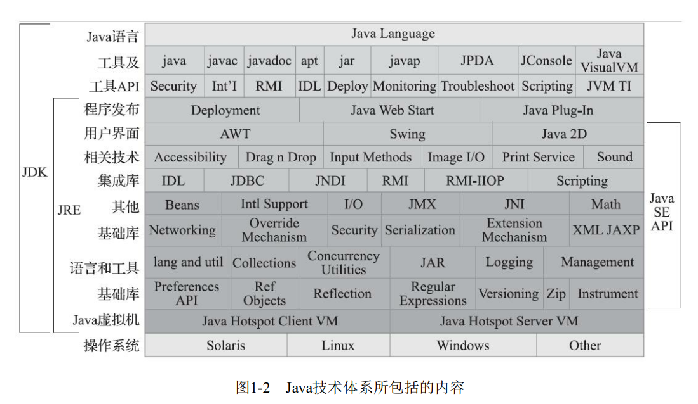
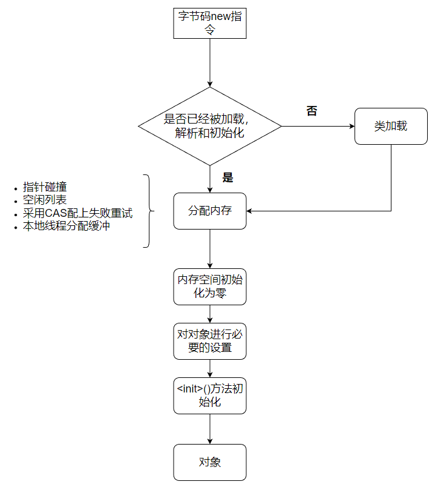

# JVM虚拟机

## Java

### java技术体系

### Java虚拟机家族

- 虚拟机始祖： Sun Classic/Exact VM  

1996年1月23日， Sun发布JDK 1.0， Java语言首次拥有了商用的正式运行环境， 这个JDK中所带的虚拟机就是Classic VM。 这款虚拟机只能使用纯解释器方式来执行Java代码， 如果要使用即时编译器那就必须进行外挂， 但是假如外挂了即时编译器的话， 即时编译器就会完全接管虚拟机的执行系统， 解释器便不能再工作了。  

- 武林盟主： HotSpot VM  

它是Sun/OracleJDK和OpenJDK中的默认Java虚拟机， 也是目前使用范围最广的Java虚拟机。  由一家名为“Longview Technologies”的小公司设计 ,Sun公司1997年收购了Longview Technologies公司， 从而获得了HotSpot虚拟机  

- 小家碧玉： Mobile/Embedded VM  

面对移动和嵌入式市场， 专门的Java虚拟机产品 。

- 天下第二： BEA JRockit/IBM J9 VM  

BEA System公司的JRockit与IBM公司的IBM J9 ，IBM J9虚拟机的职责分离与模块化做得比HotSpot更优秀  

- 软硬合璧： BEA Liquid VM/Azul VM  

Liquid VM也被称为JRockit VE（Virtual Edition， VE） ， 它是BEA公司开发的可以直接运行在自家Hypervisor系统上的JRockit虚拟机的虚拟化版本  ，Azul VM是Azul Systems公司在HotSpot基础上进行大量改进， 运行于Azul Systems公司的专有硬件Vega系统上的Java虚拟机  。

- 挑战者： Apache Harmony/Google Android Dalvik VM  

Apache Harmony是一个Apache软件基金会旗下以Apache License协议开源的实际兼容于JDK 5和JDK 6的Java程序运行平台 ，Dalvik虚拟机并不是一个Java虚拟机， 它没有遵循《Java虚拟机规范》 ， 不能直接执行Java的Class文件， 使用寄存器架构而不是Java虚拟机中常见的栈架构  

- 其他虚拟机

### 编译jdk

挖坑...

## 自动内存管理

### Java内存区域与内存溢出异常

##### 内存区域

- 程序计数器

程序计数器（Program Counter Register） 是一块较小的内存空间， 它可以看作是当前线程所执行的
字节码的行号指示器。  字节码解释器工作时就是通过改变这个计数器的值来选取下一条需要执行的字节码指令， 它是程序控制流的指示器， 分支、 循环、 跳转、 异常处理、 线程恢复等基础功能都需要依赖这个计数器来完成。  

在任何一个确定的时刻，一个处理器都只会执行一条线程中的指令，为了线程切换之后能够恢复到正确的执行位置，每条线程都有一个独立的程序计数器，各个线程互不影响。

我们称这类内存区域为“线程私有”的内存 。

如果线程正在执行的是一个Java方法， 这个计数器记录的是正在执行的虚拟机字节码指令的地址； 如果正在执行的是本地（Native） 方法， 这个计数器值则应为空（Undefined） 。此内存区域是唯一一个在《Java虚拟机规范》 中没有规定任何OutOfMemoryError情况的区域。  

- Java虚拟机栈  

java虚拟机栈也是线程私有的，它的生命周期和线程相同。

虚拟机栈描述的是Java方法执行的线程内存模型： 每个方法被执行的时候， Java虚拟机都会同步创建一个栈帧[1]（Stack Frame） 用于存储局部变量表、 操作数栈、 动态连接、 方法出口等信息。 每一个方法被调用直至执行完毕的过程， 就对应着一个栈帧在虚拟机栈中从入栈到出栈的过程。  

局部变量表存放了编译期可知的各种Java虚拟机基本数据类型（boolean、 byte、 char、 short、 int、float、long、 double） 、 对象引用（reference类型， 它并不等同于对象本身， 可能是一个指向对象起始地址的引用指针， 也可能是指向一个代表对象的句柄或者其他与此对象相关的位置） 和returnAddress类型（指向了一条字节码指令的地址） 。  

这些数据类型在局部变量表中的存储空间以局部变量槽（Slot） 来表示， 其中64位长度的long和double类型的数据会占用两个变量槽， 其余的数据类型只占用一个。   局部变量表所需的内存空间在编译期间完成分配， 当进入一个方法时， 这个方法需要在栈帧中分配多大的局部变量空间是完全确定的， 在方法运行期间不会改变局部变量表的大小。  

- 本地方法栈  

本地方法栈则是为虚拟机使用到的本地（Native）方法服务  

- Java堆  

对于Java应用程序来说， Java堆（Java Heap） 是虚拟机所管理的内存中最大的一块。  Java堆是被所有线程共享的一块内存区域， 在虚拟机启动时创建。 此内存区域的唯一目的就是存放对象实例， Java世界里“几乎”所有的对象实例都在这里分配内存。   

Java堆是垃圾收集器管理的内存区域， 因此一些资料中它也被称作“GC堆”（Garbage Collected
Heap ）。

Java堆可以处于物理上不连续的内存空间中， 但在逻辑上它应该被视为连续的， 这点就像我们用磁盘空间去存储文件一样， 并不要求每个文件都连续存放。  

- 方法区  

方法区（Method Area） 与Java堆一样， 是各个线程共享的内存区域， 它用于存储已被虚拟机加载的类型信息、 常量、 静态变量、 即时编译器编译后的代码缓存等数据。  

《Java虚拟机规范》 对方法区的约束是非常宽松的， 除了和Java堆一样不需要连续的内存和可以选择固定大小或者可扩展外， 甚至还可以选择不实现垃圾收集。  

这区域的内存回收目标主要是针对常量池的回收和对类型的卸载。

- 运行时常量池

运行时常量池（Runtime Constant Pool） 是方法区的一部分 ，用于存放编译期生成的各种字面量与符号引用， 这部分内容将在类加载后存放到方法区的运行时常量池中。  

Java虚拟机对于Class文件每一部分（自然也包括常量池） 的格式都有严格规定， 如每一个字节用于存储哪种数据都必须符合规范上的要求才会被虚拟机认可、 加载和执行， 但对于运行时常量池，《Java虚拟机规范》 并没有做任何细节的要求 。

并非预置入Class文件中常量池的内容才能进入方法区运行时常量池， 运行期间也可以将新的常量放入池中， 这种特性被开发人员利用得比较多的便是String类的intern()方法。  

既然运行时常量池是方法区的一部分， 自然受到方法区内存的限制， 当常量池无法再申请到内存
时会抛出OutOfMemoryError异常 。

- 直接内存  

直接内存（Direct Memory） 并不是虚拟机运行时数据区的一部分， 也不是《Java虚拟机规范》 中定义的内存区域。 但是这部分内存也被频繁地使用， 而且也可能导致OutOfMemoryError异常出现 。本机直接内存的分配不会受到Java堆大小的限制， 但是， 既然是内存， 则肯定还是会受到本机总内存  

##### HotSpot虚拟机对象探秘  

- 对象的创建

当Java虚拟机遇到一条字节码new指令时， 首先将去检查这个指令的参数是否能在常量池中定位到一个类的符号引用， 并且检查这个符号引用代表的类是否已被加载、 解析和初始化过。 如果没有， 那必须先执行相应的类加载过程。

在类加载检查通过后， 接下来虚拟机将为新生对象分配内存。   对象所需内存的大小在类加载完成后便可完全确定 ， 为对象分配空间的任务实际上便等同于把一块确定大小的内存块从Java堆中划分出来。  

假设Java堆中内存是绝对规整的， 所有被使用过的内存都被放在一边， 空闲的内存被放在另一边， 中间放着一个指针作为分界点的指示器， 那所分配内存就仅仅是把那个指针向空闲空间方向挪动一段与对象大小相等的距离， 这种分配方式称为“指针碰撞”（Bump ThePointer） 。   

但如果Java堆中的内存并不是规整的， 已被使用的内存和空闲的内存相互交错在一起， 那就没有办法简单地进行指针碰撞了， 虚拟机就必须维护一个列表， 记录上哪些内存块是可用的， 在分配的时候从列表中找到一块足够大的空间划分给对象实例， 并更新列表上的记录， 这种分配方式称为“空闲列表”（Free List） 。   

选择哪种分配方式由Java堆是否规整决定， 而Java堆是否规整又由所采用的垃圾收集器是否带有空间压缩整理（Compact） 的能力决定。   

所以对象创建的过程：

- 对象内存布局
- 对象的访问定位